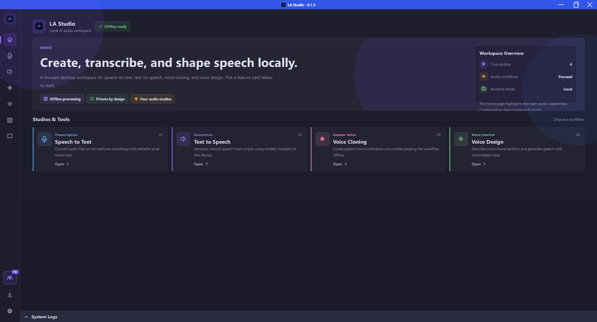
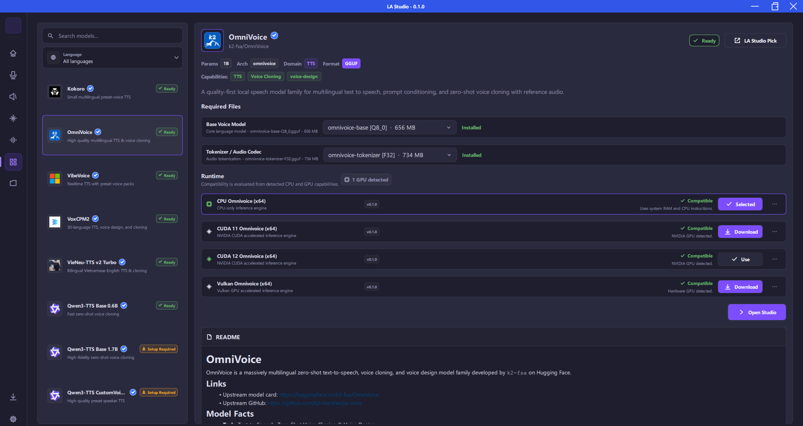
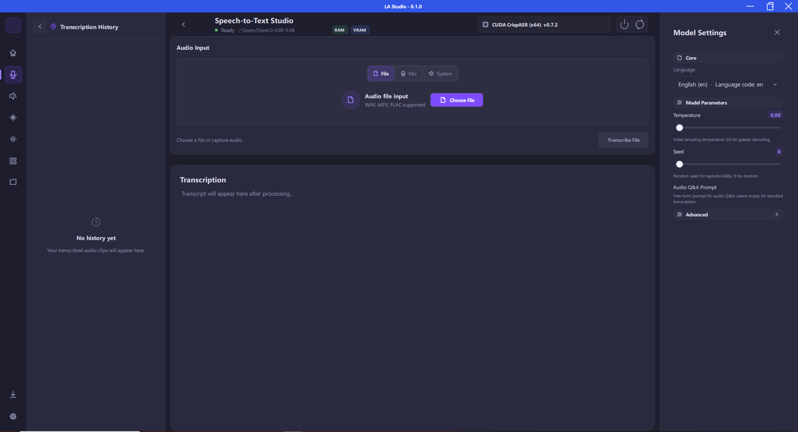
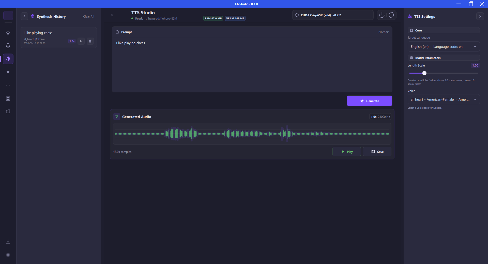
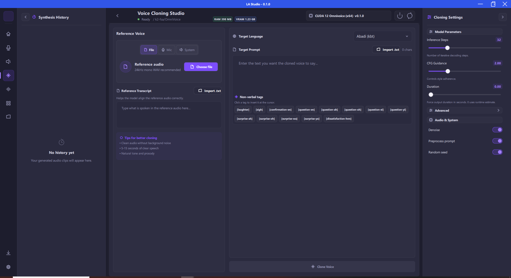
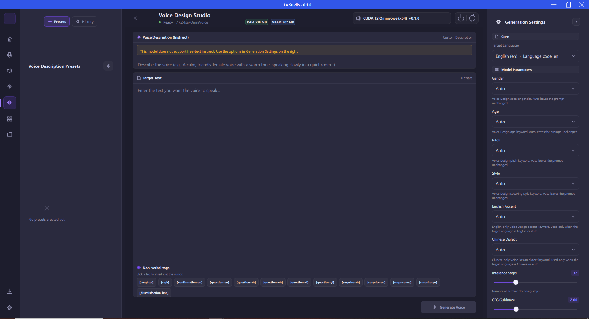
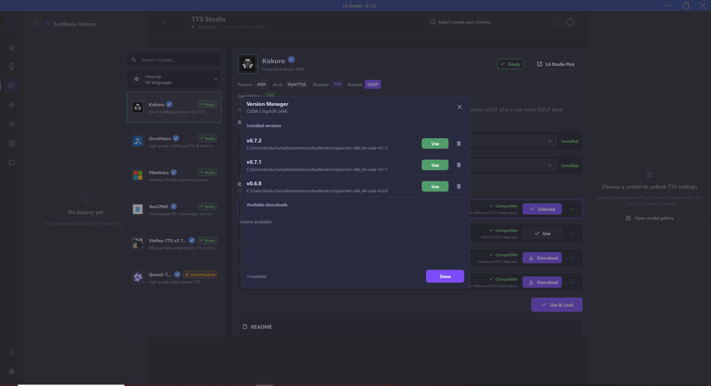
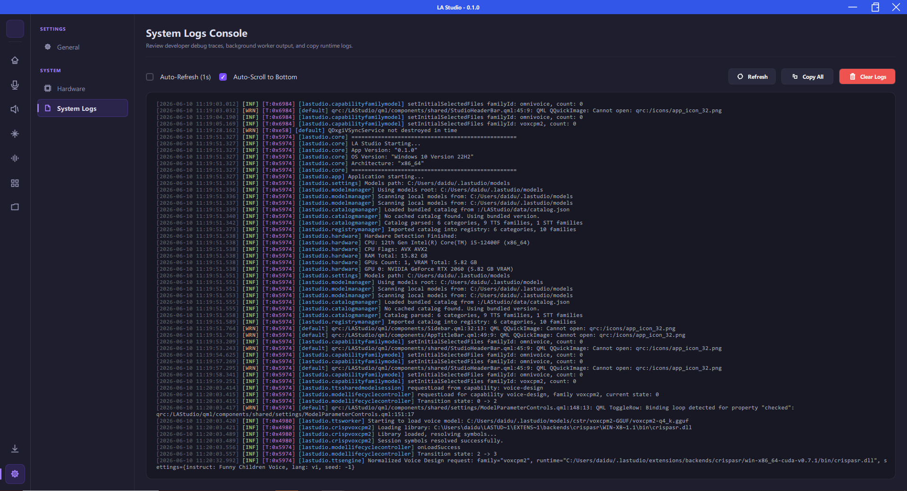
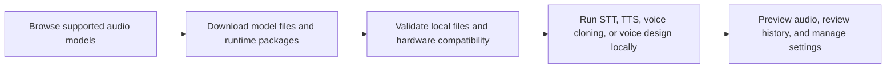

# LA Studio

**Offline AI Audio Studio for Speech-to-Text, Text-to-Speech, Voice Cloning, and Voice Design**

Run private AI audio workflows locally: speech recognition, voice generation, voice cloning, voice design, model downloads, and runtime management in one native desktop app.

[Overview](#overview) |
[Features](#features) |
[Screenshots](#screenshots) |
[Supported Models](#supported-models-and-runtimes) |
[Privacy](#privacy-and-offline-operation) |
[Roadmap](#roadmap) |
[Community](#community) |
[Acknowledgements](#acknowledgements)

 

 
 

---

## Overview

LA Studio, short for Local Audio Studio, is an offline AI audio workstation for creators, developers, researchers, and teams that need local speech AI without sending audio files, prompts, or generated voices to cloud APIs.

The app brings together local speech-to-text, text-to-speech, voice cloning, voice design, model discovery, Hugging Face downloads, runtime installation, hardware checks, audio preview, history, settings, and logs behind a modern desktop interface.

This public repository is used for public-facing project information. The main development repository is private.

## Project Updates

### 2026-07-14 - Version 0.1.9: Voice Isolator Support

LA Studio version 0.1.9 begins support for **Voice Isolator**, a local source-separation workflow for extracting vocal and background stems from audio or video files. The new studio supports sherpa-onnx separation models, including UVR-MDX-NET Vocals and Spleeter two-stem models, with progress reporting, waveform previews, playback, and stem export. Processing remains fully offline on the user's machine.

### 2026-07-10 - Version 0.1.8: VieNeu-TTS v3 Upstream Update

LA Studio version 0.1.8 updates [VieNeu-TTS-v3-Turbo](https://huggingface.co/pnnbao-ump/VieNeu-TTS-v3-Turbo) support to follow the latest changes from the original author, including updated reference/denoise options and improved native runtime integration. This release also improves TTS cancellation, audio playback controls, model setup guidance, and backend thread management.

### 2026-07-03 - Version 0.1.7: Kokoro Vietnamese Support

LA Studio version 0.1.7 supports Vietnamese text-to-speech using the fine-tuned Kokoro-82M model. Special thanks to **iamdinhthuan** for the original [Kokoro-Vietnamese](https://github.com/iamdinhthuan/Kokoro-Vietnamese) repository and model training.

### 2026-07-01 - VieNeu-TTS-v3-Turbo Support

LA Studio supports [VieNeu-TTS-v3-Turbo](https://huggingface.co/pnnbao-ump/VieNeu-TTS-v3-Turbo), a high-fidelity 48 kHz Vietnamese-English text-to-speech model by Pham Nguyen Ngoc Bao.

### 2026-06-23 - Nemotron-3.5 Streaming ASR

LA Studio supports NVIDIA Nemotron-3.5 ASR Streaming 0.6B for local multilingual speech-to-text workflows.

## Features

| Feature | What it does |
| --- | --- |
| Speech-to-Text Studio | Transcribe microphone input or audio files into text with local speech recognition models. |
| Text-to-Speech Studio | Generate natural speech from text with configurable model parameters and audio preview. |
| Voice Cloning | Create speech from a reference voice sample for local zero-shot voice cloning workflows. |
| Voice Design | Generate or shape voices from descriptive text prompts when supported by the selected model. |
| Voice Isolator | Separate vocals and background audio into two stems from local audio or video files. |
| Models Gallery | Browse curated model families, inspect required files, download assets, and manage local model availability. |
| Runtime Management | Install, validate, and select compatible CPU, CUDA, Vulkan, or other runtime packages. |
| Offline Privacy | Keep audio, prompts, generated speech, and model inference on the user's machine. |
| Native Desktop UI | Use a responsive desktop interface with audio input controls, previews, history, settings, and logs. |

## Screenshots

| Home | Models Gallery |
| --- | --- |
|  |  |

| Speech-to-Text | Text-to-Speech |
| --- | --- |
|  |  |

| Voice Cloning | Voice Design |
| --- | --- |
|  |  |

| Runtime Settings | System Logs |
| --- | --- |
|  |  |

## Use Cases

- Run private speech transcription locally for interviews, meetings, research recordings, podcasts, and voice notes.
- Generate local voiceovers for video, learning content, prototypes, narration, and accessibility workflows.
- Test multiple open speech and audio models from a single desktop interface.
- Experiment with voice cloning and voice design without relying on external inference APIs.
- Evaluate local AI audio workflows before integrating them into larger production pipelines.

## How LA Studio Works

1. Choose an STT, TTS, voice cloning, or voice design model family.
2. Download the required model files and runtime package.
3. LA Studio validates local files, runtime compatibility, and available hardware acceleration.
4. Use the studio pages to transcribe audio, generate speech, clone voices, or design voices offline.

## Supported Models and Runtimes

LA Studio is catalog-driven, so supported models can evolve over time. Current public model families include:

| Category | Example model families |
| --- | --- |
| Speech-to-Text | Whisper, Qwen3-ASR 0.6B, Qwen3-ASR 1.7B, Nemotron-3.5 ASR Streaming |
| Text-to-Speech | Kokoro 82M, Kokoro Vietnamese, VibeVoice Realtime, VieNeu-TTS v2 Turbo, VieNeu-TTS v3 Turbo, Qwen3-TTS |
| Voice Cloning | VoxCPM2, OmniVoice, Qwen3 custom voice packages |
| Voice Design | VoxCPM2 voice design, Qwen3 voice design packages |

Runtime support depends on model availability and platform support. LA Studio can use local CPU execution and hardware acceleration paths such as CUDA or Vulkan when compatible packages are available.

## Privacy and Offline Operation

LA Studio is designed for local inference. Audio recordings, prompts, generated speech, transcriptions, model selections, and runtime activity stay on the local machine unless the user explicitly downloads model files or runtime packages from external sources.

The app is built for workflows where privacy, reproducibility, and local control matter.

## Roadmap

- [x] Local speech-to-text studio
- [x] Local text-to-speech studio
- [x] Model gallery and managed downloads
- [x] Runtime and hardware management
- [x] Voice cloning workflow foundation
- [x] Voice design workflow foundation
- [ ] Broader cross-platform packaging
- [ ] Expanded model validation and benchmark reporting
- [ ] Advanced timeline-style audio editing
- [ ] Additional local speech-to-speech and multimodal audio workflows

## Community

Join the community to connect with other developers and creators, share results, and get support:

- **Discord Server:** [Join our Discord](https://discord.gg/nbGpQBhET)
- **Facebook Group:** [Amatow Coder Community](https://www.facebook.com/groups/amatowcoder.community/announcements)

## Acknowledgements

LA Studio exists because of the open-source runtime, tooling, and model ecosystems around local speech AI. Thank you to the maintainers and contributors of these projects:

- [whisper.cpp](https://github.com/ggml-org/whisper.cpp) and [OpenAI Whisper](https://github.com/openai/whisper)
- [CrispASR](https://github.com/CrispStrobe/CrispASR)
- [omnivoice.cpp](https://github.com/dduongtrandai/omnivoice.cpp) and the [k2-fsa / sherpa-onnx](https://github.com/k2-fsa/sherpa-onnx) ecosystem
- [VieNeu-TTS.cpp](https://github.com/dduongtrandai/VieNeu-TTS.cpp)
- [Kokoro](https://github.com/hexgrad/kokoro)
- [Kokoro-Vietnamese](https://github.com/iamdinhthuan/Kokoro-Vietnamese)
- [Qwen speech models](https://github.com/QwenLM)
- [VoxCPM2](https://huggingface.co/openbmb/VoxCPM2)
- [VibeVoice](https://huggingface.co/microsoft/VibeVoice-Realtime-0.5B)
- [OmniVoice](https://huggingface.co/k2-fsa/OmniVoice)
- [VieNeu-TTS v2 Turbo](https://huggingface.co/pnnbao-ump/VieNeu-TTS-v2-Turbo)
- [VieNeu-TTS-v3-Turbo](https://huggingface.co/pnnbao-ump/VieNeu-TTS-v3-Turbo)

Runtime packages and model files may have their own licenses, terms, and attribution requirements. Review upstream project and model licenses before redistributing any bundled runtime or model assets.

## License

License details will be published with the applicable source or release package.

---

**LA Studio helps you run private, local AI audio workflows on your own machine.**
